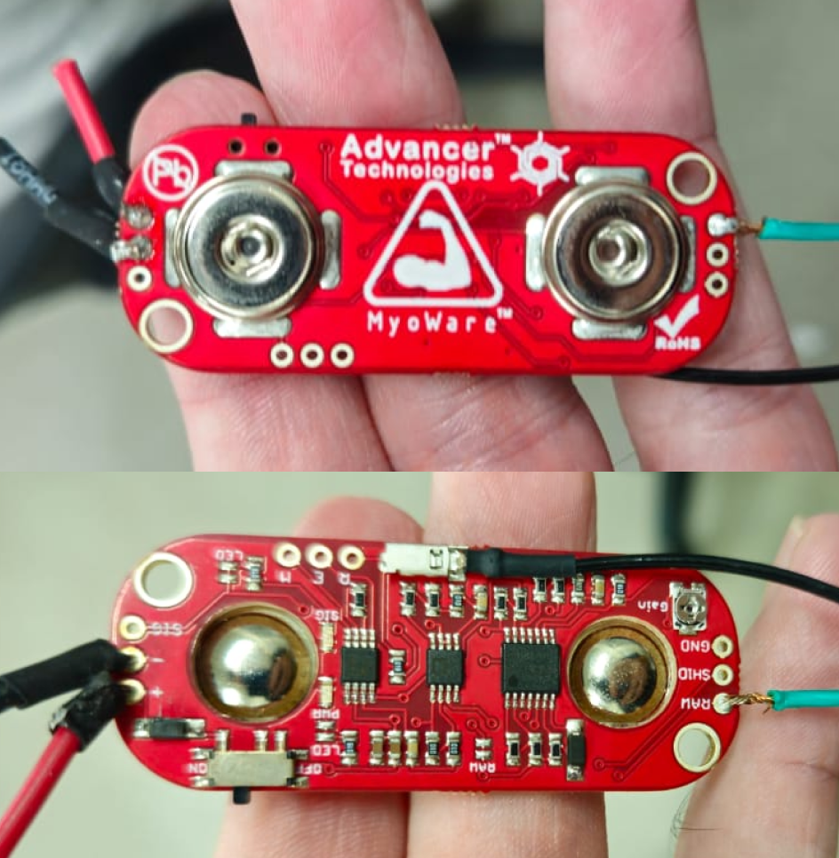
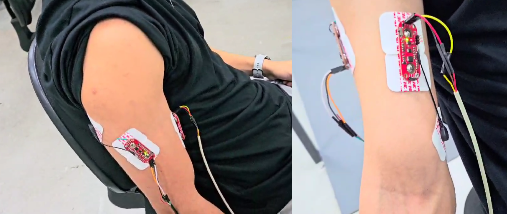
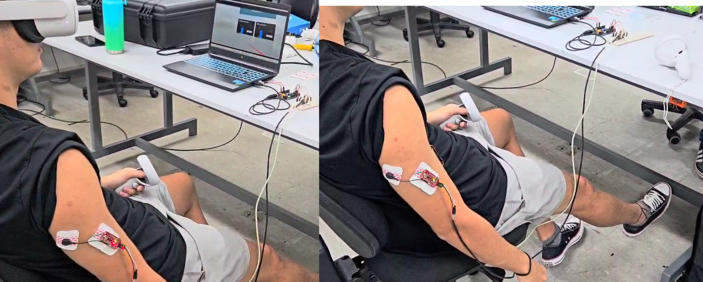
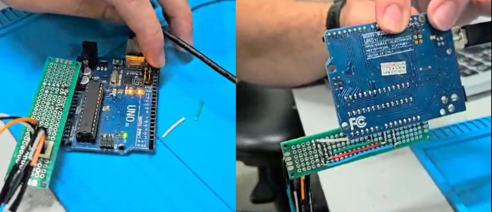
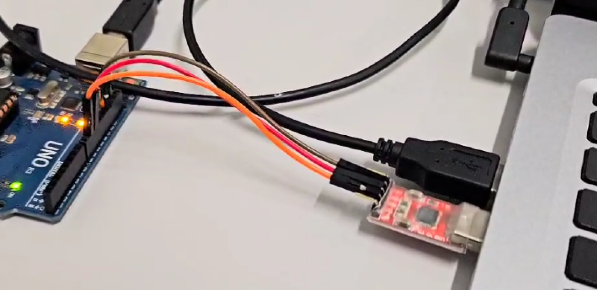
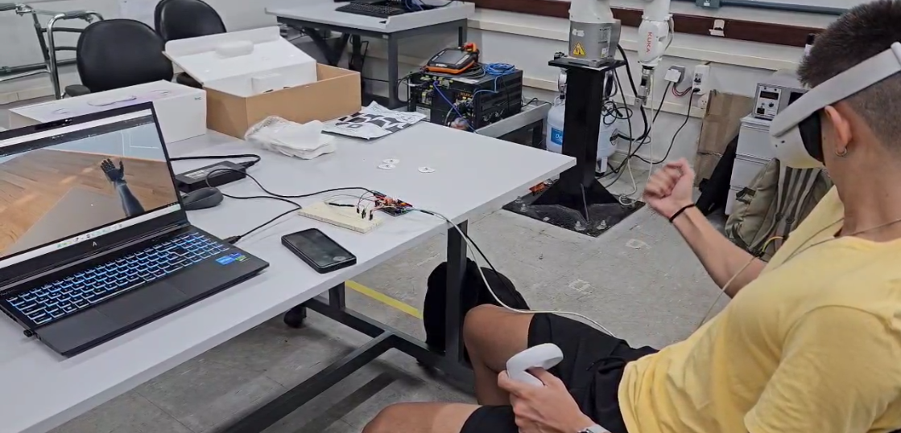
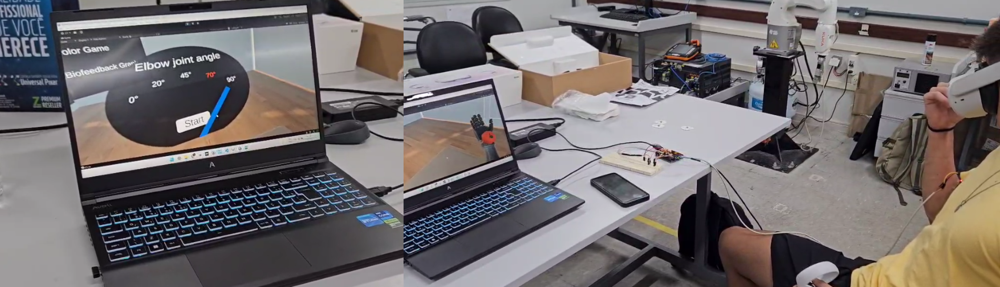

# Sistema Biomecânico Baseado em Realidade Virtual

## Visão Geral

### Descrição Breve

Este projeto visa utilizar sensores de EMG para analisar e aproveitar dados de sinais musculares para aprimorar tratamentos para indivíduos com deficiências nos membros superiores, como amputacoes, com o suporte de um ambiente de realidade virtual.

### Como Funciona

Dois sensores musculares são fixados no braço do paciente, um no bíceps e o outro no tríceps. Após o paciente colocar os óculos de realidade virtual e estar posicionado corretamente, inicia-se a cena de calibração. O paciente realiza **flexao** e **extensão** máximas para obter parâmetros precisos da posição do braço. A calibração é feita em duas etapas: **extensão** e **flexao**, cada uma com duração de 25 segundos.

Os parâmetros são calculados automaticamente, e o mapa de co-contracao e exibido na cena do Unity. A equipe avalia a qualidade da calibração e, se necessário, a calibração pode ser repetida. Durante esse processo, o usuário pode ver os valores normalizados dos sensores no gráfico.

Após a calibração, a cena principal começa, e o paciente pode ver o braço virtual se movendo em resposta à sua ativação muscular.

## Hardware

Estes foram os principais materiais utilizados no projeto:

- Eletrodos de ECG descartáveis
- Fios de cobre (jumpers)
- Placa Arduino UNO
- Protoboard (ou Placa Perfurada)
- Placa MyoWare (Sensor Muscular)
- Óculos de Realidade Virtual - (Oculus Quest 2)
- Lâmina Descartável
- Álcool Esterilizante
- Conversor Usb-Serial

### Sensores Myoware

### Myoware Sensors - Montagem final

### Esquemático do Projeto

### Placa Arduino

## Software

Para as especificações de configuração do software, foram utilizados alguns aplicativos chave:

- Unity *Build 2022.3.51F*
- Scripts em Python *3.11* 
- Código Arduino

> Mais informações sobre os scripts de Arduino e Python podem ser encontradas [neste repositório](https://github.com/fiorotticaio/Hardware-and-auxiliary-codes-for-the-biomechanical-system).

## Mídia

### Ambiente de Realidade Virtual - Calibração

### Ambiente de Realidade Virtual - Simulação

### Jogos

Existem alguns *mini-games* dentro da cena principal, que servem para estimular o paciente de uma maneira divertida. Com o controle do Quest 2 do braco saudavel, o usuário pode selecionar o jogo que quer testar.

O primeiro é um desafio para que o usuário tente manter a angulação do braço mecânico em um certo ângulo indicado na tela. Simples de entender, mas muito mais desafiador do que parece

O segundo é o jogo das cores. Movendo o braço mecânico, o paciente deve apontar para a cor correta, indicada na tela, e apertar o gatilho do controle.

Além disso, o usuário pode simular o movimento de pegar uma maçã, na opção "mover maçã".

### Mais informações

Neste [vídeo](https://youtu.be/uEduPgnbO7c) mais detalhes são apresentados mostrando como o sistema funciona.

## Autores

- [@fiorotticaio](https://github.com/fiorotticaio)
- [@matheusschreiber](https://github.com/matheusschreiber)
- [@viniciuscole](https://github.com/viniciuscole)

## Bonus

Este projeto foi apresentado na [Exposição de Computação e Tecnologia](https://computacao-ufes.github.io/mostra/pic2_EC_20241.html) na [Universidade Federal do Espírito Santo](ufes.br).
