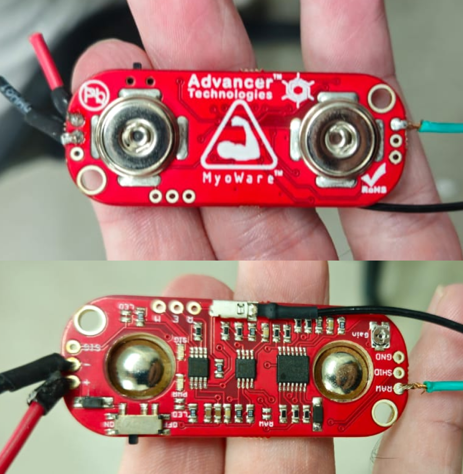
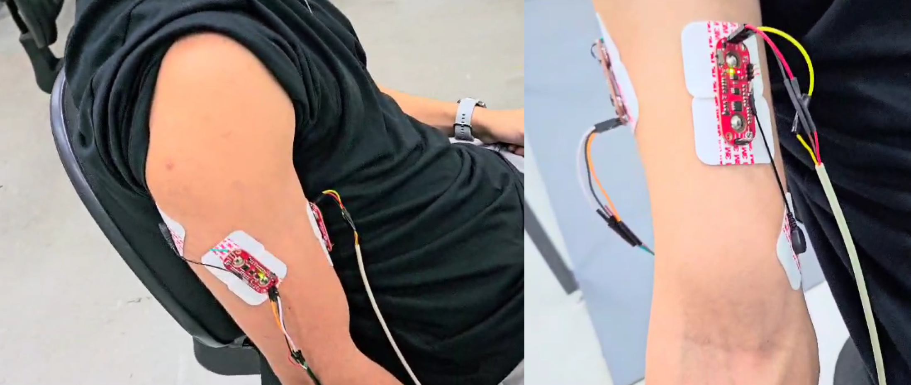
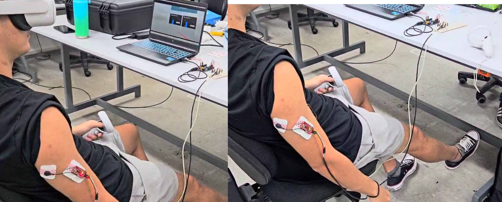
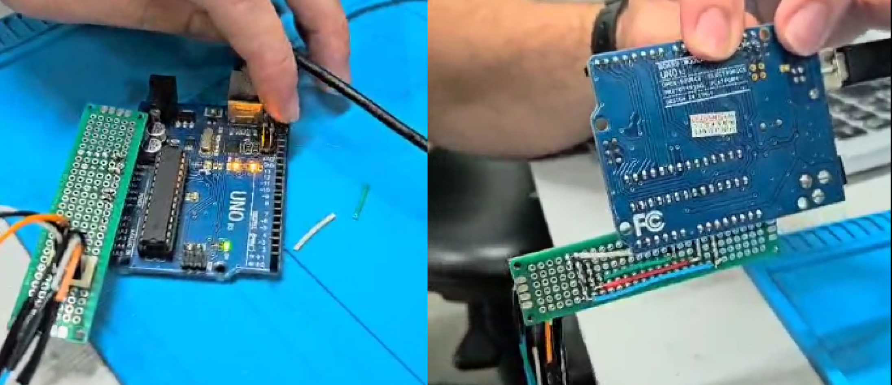
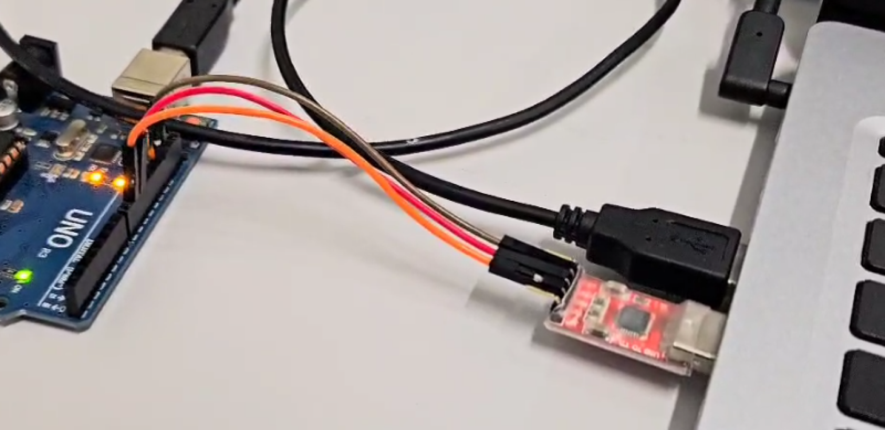
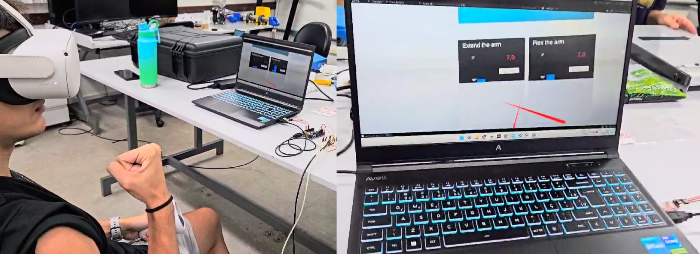
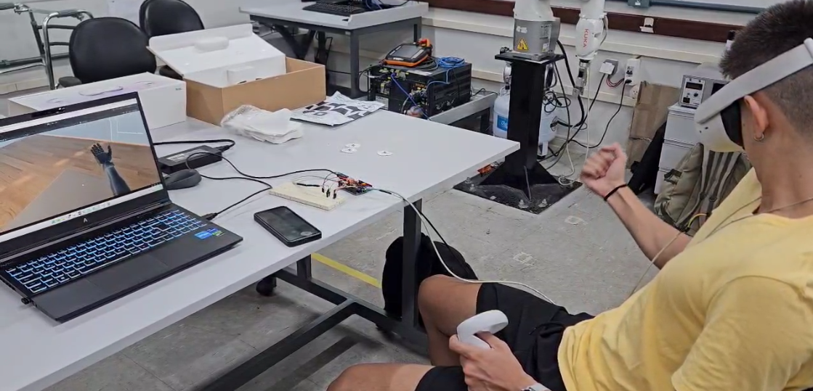
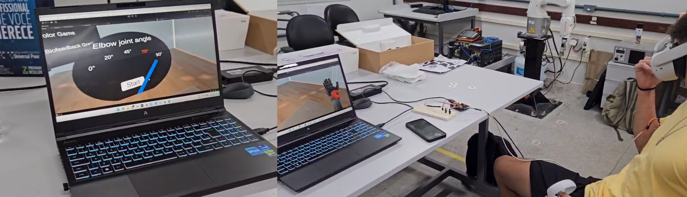

# Virtual Reality based Biomechanical System

> Portuguese [README](README.br.md)

## Overview

### Brief description

This project aims to utilize EMG sensors to analyze and harness muscle signal data to enhance treatments for individuals with upper limb disabilities, such as amputees, with the support of a virtual reality environment.

### How it works

Two muscle sensors are attached to the patient's arm, one on the biceps and the other on the triceps. After the patient puts on the virtual reality oculus and is positioned correctly, the calibration scene begins. The patient performs maximum **flexion** and **extension** to obtain accurate arm position parameters. Calibration is done in two stages: **extension** and **flexion**, each lasting 25 seconds.

Parameters are calculated automatically, and the co-contraction map are displayed in the Unity scene. The team evaluates the calibration quality based on these and repeat the calibration if needed. During this process, the user can see normalized sensor values on the graph.

After calibration, the main scene starts, and the patient can see the virtual arm moving in response to muscle activation.

## Hardware

These were the key materials utilized on the project:

- Disposable ECG Electrodes
- Copper wires (jumpers)
- Arduino UNO Board
- Breadboard (or Perforated Board)
- MyoWare Board (Muscle Sensor)
- Virtual Reality Oculus - (Oculus Quest 2)
- Disposable Razor
- Sterilizing Alcohol
- Usb-Serial Converter

### Myoware Sensors

### Myoware Sensors - Main setup

### Project Schematic

### Arduino Board

## Software

For the software setup specifics, some key applications were used:

- Unity *Build 2022.3.51F*
- Python *3.11* scripts 
- Arduino code

> More info about the arduino and python scripts can be found on [this repo](https://github.com/fiorotticaio/Hardware-and-auxiliary-codes-for-the-biomechanical-system).

## Media

### Virtual Reality Environment - Calibration

### Virtual Reality Environment - Simulation

### Games

There's a few mini-games in the main scene, designed to engage the patient in a fun way. Using the Quest 2 controller in the healthy arm, the user can select the game they want to try.

The first is a challenge where the user tries to keep the virtual arm at a certain angle indicated on the screen. It is simple to understand, but much more challenging than it seems.

The second is the color game. By moving the virtual arm, the patient must point to the correct color, indicated on the screen, and pull the trigger on the controller to score.

Additionally, the user can simulate the action of picking an apple in the "move apple" option.

### More footage

On [this video](https://youtu.be/uEduPgnbO7c) more details are presented showing how the system works.

## Authors

- [@fiorotticaio](https://github.com/fiorotticaio)
- [@matheusschreiber](https://github.com/matheusschreiber)
- [@viniciuscole](https://github.com/viniciuscole)

## Extra

This project was presented on the [Computing and Technology Exhibition](https://computacao-ufes.github.io/mostra/pic2_EC_20241.html) at the [Universidade Federal do Espírito Santo](ufes.br).
