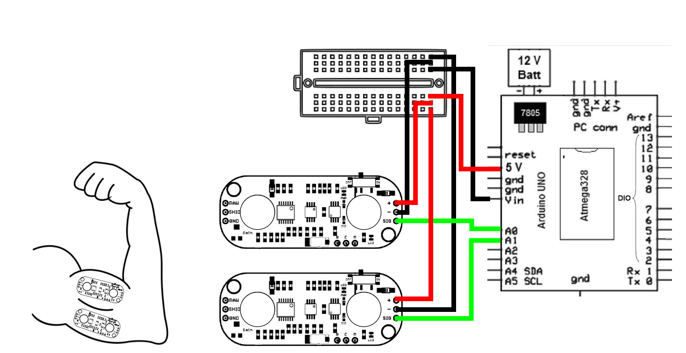
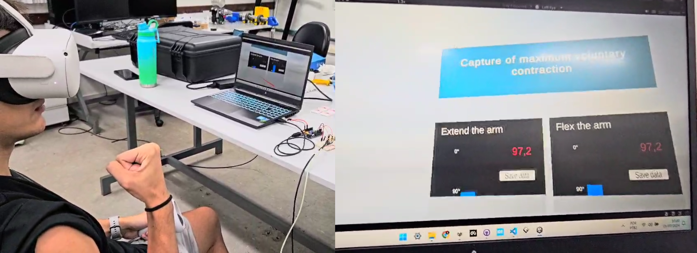

# Virtual Reality based Biomechanical System

> Portuguese [README](README.br.md)

## Overview

### Brief description

This project aims to utilize ECG sensors to analyze and harness muscle signal data to enhance treatments for individuals with partial limb disabilities, such as those with incomplete upper or lower extremities, with the support of a virtual reality environment.

### How it works

Two muscle sensors are attached to the patient's arm, one on the biceps and the other on the triceps. After the patient puts on the virtual reality glasses and is positioned correctly, the calibration scene begins. The patient performs maximum **contraction** and **extension** to obtain accurate arm position parameters. Calibration is done in two stages: **extension** and **contraction**, each lasting 25 seconds. The user starts and ends the calibration using the controller.

Parameters are calculated automatically, and contraction and extension maps are displayed in the Unity scene. The team evaluates the calibration quality based on these and repeat the calibration if needed. During this process, the user can see normalized sensor values on the graph.

After calibration, the main scene starts, and the patient can see the mechanical arm moving in response to muscle activation.

## Hardware

These were the key materials utilized on the project:

- Disposable ECG Electrodes
- Copper wires (jumpers)
- Arduino UNO Board
- Breadboard (or Perforated Board)
- MyoWare Board (Muscle Sensor)
- Virtual Reality Glasses - (Oculus Quest 2)
- Disposable Razor
- Sterilizing Alcohol

### Myoware Sensors

### Project Schematic

### Arduino Board

## Software

For the software setup specifics, some key applications were used:

- Unity *Build 2022.3.51F*
- Python *3.11* scripts 
- Arduino code

> More info about the arduino and python scripts can be found on [this repo](https://github.com/fiorotticaio/Hardware-and-auxiliary-codes-for-the-biomechanical-system).

## Media

### Virtual Reality Environment - Calibration

### Virtual Reality Environment - Simulation

### More footage

On [this video](https://youtu.be/uEduPgnbO7c) more details are presented showing how the system works.

## Authors

- [@fiorotticaio](https://github.com/fiorotticaio)
- [@matheusschreiber](https://github.com/matheusschreiber)
- [@viniciuscole](https://github.com/viniciuscole)

## Extra

This project was presented on the [Computing and Technology Exhibition](https://computacao-ufes.github.io/mostra/pic2_EC_20241.html) at the [Universidade Federal do Espírito Santo](ufes.br).